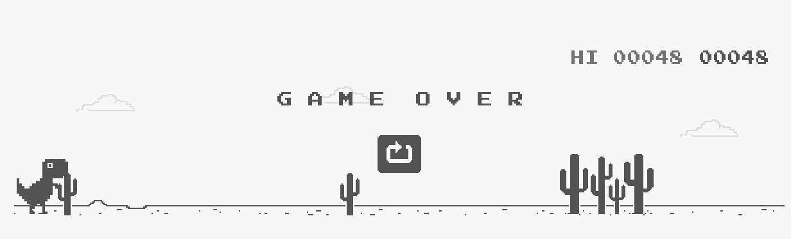
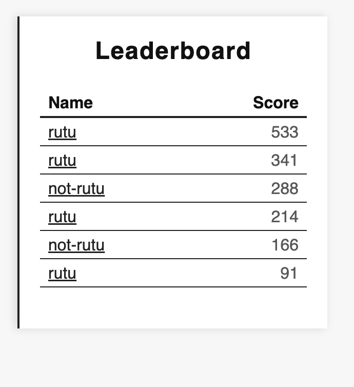
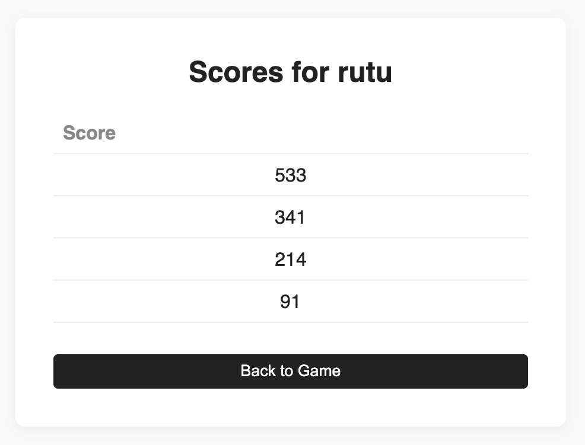

# Simple Server 

Let's write a Python server for the Google Chrome's Dino game. 




We will also add a leaderboard feature to the game, which shows player and score data.

For each player, we will store the top 5 scores. 




And we'll also display the scores for a selected user. 




# Part-1: Writing the Python Microservice

In our microservice, we will define the following endpoints. 

| METHOD | PATH          | Purpose                                                              | Returns                                                                                                                                                                          |
|--------|---------------|----------------------------------------------------------------------|----------------------------------------------------------------------------------------------------------------------------------------------------------------------------------|
| GET    | /health-check | Health Check endpoint to validate if the server is running properly  | {"status":"ok"}                                                                                                                                                                  |
|   GET  | /             | Serves the dino game                                                 | The dino game html file                                                                                                                                                          |
| GET    | /user         | Serves the User Scores                                               | The user score html file                                                                                                                                                         |
| POST   | /score/\<name\> | Save a user's score having \<name\> name                               | {"status": "success"}                                                                                                                                                            |
| GET    | /score/\<name\> | Fetch a user's score having \<name\> name                              | {"name":"rutu","scores":[533,341,214,91]}                                                                                                                                        |
| GET    | /scores       | Fetch all scores, in the form of a leaderboard                       | [{"name":"rutu","score":533},{"name":"rutu","score":341},{"name":"not-rutu","score":288},{"name":"rutu","score":214},{"name":"not-rutu","score":166},{"name":"rutu","score":91}] |


The user scores are stored in the a local json file. 

We have the following files: 

- **main.py**: defines the REST application for serving the game and the user scores. 
- **game/dino.html**: contains the Google's T-Rex game code 
- **game/user.html**: contains the html file for displaying user's score
- **requirements.json**: contains all the python dependencies required to run this application


# Part-2: Run the microservice

## Install python virtual env

```shell
sudo apt install -y python3-venv
```

## Setup the virtual environment 

Create the python virtual environment

```shell
python3 -m venv .venv
```

Activate the virtual environment

```shell
source .venv/bin/activate
```

Install the requirements

```shell
pip3 install -r requirements.txt
```

Run the application server 

```shell
gunicorn --bind 0.0.0.0:8080 main:app
```

